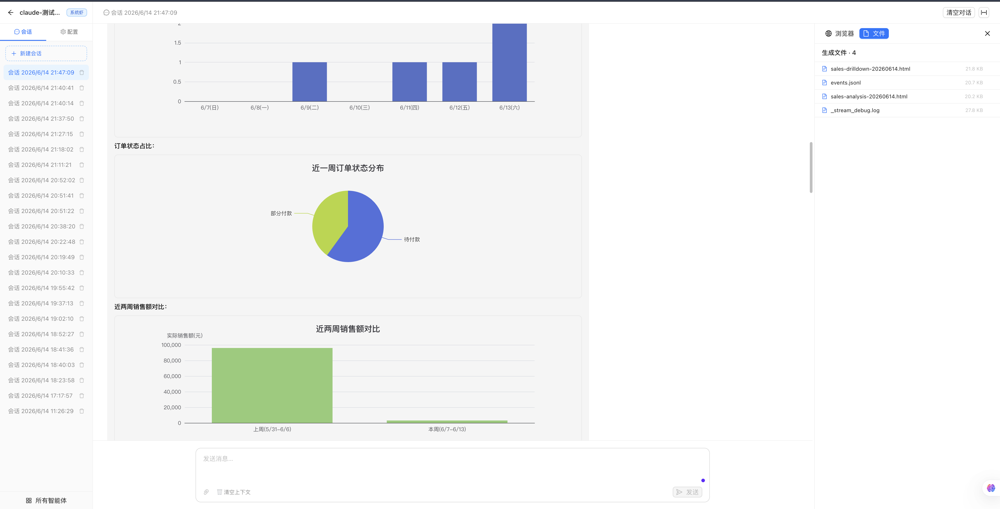
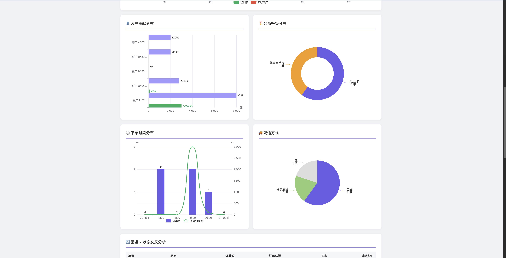

# Vera — 智能 Agent 构建与编排平台

高度可扩展的智能 Agent 构建与编排平台，打破单一 AI 工具的边界。通过深度集成官方 Claude Agent SDK 与灵活的自建 Agent 架构，为开发者提供从"开箱即用"到"深度定制"的完整解决方案。

## demo




## ✨ 核心特性

- **双引擎驱动架构** — 原生支持 Claude Agent SDK，一键接入代码理解、文件读写与命令执行能力；同时提供自建 Agent 接口，允许通过 MCP 协议或自定义 Python/Node.js 脚本扩展专属工具链。
- **渐进式技能加载 (Skills System)** — 内置标准化的 Skill 规范，复杂工作流封装为可复用的技能包。Agent 按需加载指令，节省 Token 消耗并提升响应精准度。
- **企业级安全与权限管控** — 细粒度的权限模式（只读、自动批准编辑、拦截确认），结合 Hook 机制在工具调用前后进行安全审计。
- **多智能体协同编排** — 支持定义多个专属 Sub-Agent（代码审查员、安全扫描器、文档生成器），通过上下文隔离实现任务分发与并行处理。
- **流式思考过程展示** — 实时渲染 Agent 的推理步骤、工具调用和中间结果，支持折叠/展开和持久化存储。

## 架构

```
前端 (React)
  ↓ WebSocket
API 层 (FastAPI)
  ↓ AgentAdapter
agent_runtime/
├── claude/      → Claude Agent SDK (direct, 无 pipes, 无死锁)
└── normal/      → 裸 LLM HTTP API
```

## 目录结构

```
vera-agent/
├── frontend/   # React 18 + TypeScript + Vite + Ant Design + Zustand
├── backend/
│   ├── api/           # FastAPI 路由 + WebSocket
│   ├── agent_runtime/ # Agent 运行时 (claude/normal 双引擎)
│   └── data/          # SQLite DB + workspaces
└── docs/              # 协议文档
```

## 快速开始

### 环境要求

- Node.js 18+ with [pnpm](https://pnpm.io)
- Python 3.11+

### 后端

```bash
cd backend

# 1. 创建虚拟环境
python3.11 -m venv .venv
source .venv/bin/activate

# 2. 安装依赖（pyproject.toml 已声明全部依赖，一次装齐）
pip install --upgrade pip -i https://pypi.tuna.tsinghua.edu.cn/simple/
pip install -e . -i https://pypi.tuna.tsinghua.edu.cn/simple/

# 选配：国内镜像加速
# pip config set global.index-url https://pypi.tuna.tsinghua.edu.cn/simple/
```

> `cryptography` 最新版需要 Rust 编译链，`pyproject.toml` 已锁定 `>=42,<45` 避开。
> 如果本地 Rust 工具链正常（`rustc -V`），可以解除上限安装最新版。

#### 启动方式

统一通过 `python -m uvicorn` 启动（`source activate` 后 `python` 即 venv 的）：

```bash
cd backend
source .venv/bin/activate

# 本地子进程模式（无需 Docker）
AGENT_USE_DOCKER=0 python -m uvicorn api.main:app --host 127.0.0.1 --port 18080 --reload

# Docker 隔离模式（推荐）
AGENT_USE_DOCKER=1 python -m uvicorn api.main:app --host 127.0.0.1 --port 18080 --reload
```

> ⚠️ 确保在 `source .venv/bin/activate` 之后执行，不要用系统的 `uvicorn` 命令。

#### 配置（`.env`）

复制模板并修改：

```bash
cp .demo.env .env
```

核心配置项：

| 环境变量 | 默认值 | 说明 |
|---------|--------|------|
| `VERA_SESSION_SECRET` | 空 | Session token 签名密钥，**生产必改**为随机 64 位字符串 |
| `AGENT_USE_DOCKER` | `1` | `1`=Docker 容器隔离，`0`=本地子进程 |
| `AGENT_DOCKER_IMAGE` | `vera-agent-runner:latest` | Agent 容器镜像名 |
| `AGENT_MAX_CONCURRENT_TURNS` | `2` | 每用户最大并发 turn 数 |
| `VERA_MCP_JWT_PRIVATE_KEY` | 空 | http/sse MCP 的 RS256 JWT 签发私钥（PEM 单行 `\n` 格式），不配则 JWT 注入静默关闭 |
| `VERA_MCP_JWT_ISSUER` | `vera-agent` | JWT 签发方标识 |
| `VERA_MCP_JWT_TTL` | `3600` | JWT 有效期（秒） |
| `DEEPSEEK_API_KEY` | 空 | DeepSeek API key（normal 引擎用） |

详细部署流程见 [DEPLOY_ALIYUN.md](DEPLOY_ALIYUN.md)。

- API: `http://127.0.0.1:18080/api/v1` · Docs: `http://127.0.0.1:18080/docs`
- 首次运行自动创建 SQLite 数据库并初始化种子数据
- 默认登录账号: `admin`，密码: `123456`
- 登录接口: `POST /api/v1/auth/login`，body `{"identifier": "admin", "password": "123456"}`，返回 `data.token`，后续请求通过 `Authorization: Bearer <token>` 携带身份

### 前端

```bash
cd frontend
pnpm install
pnpm dev    # http://127.0.0.1:3000
```

## Agent 模式

| 模式 | 引擎 | 适用场景 |
|------|------|---------|
| `claude` | Claude Agent SDK | 工具调用、代码编写、文件操作 |
| `normal` | 自建 LLM HTTP | DeepSeek/GLM 等 Anthropic 协议兼容模型 |

## 协议

前端通过 WebSocket 接收结构化事件流，详见 [协议文档](docs/websocket-chat-protocol.md)。支持推理步骤、工具调用、中间草稿和最终回复的实时渲染。
